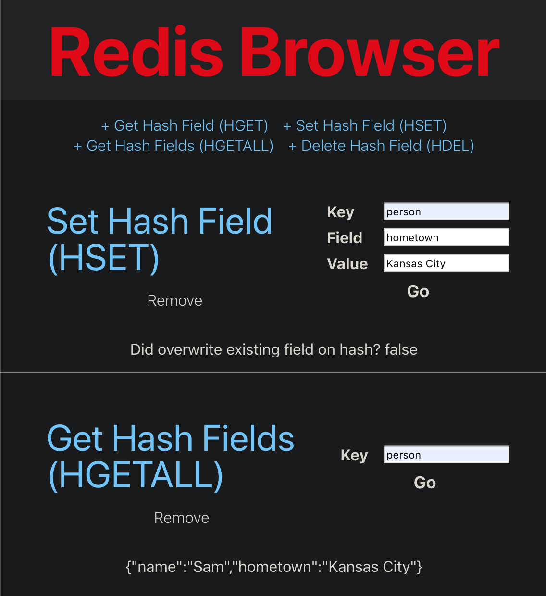

# Redis Browser

A simple, web-based UI and REST API for browsing Redis data

## Running with Docker
1. Navigate to the `docker` directory
1. Run `docker-compose up`
1. UI starts at [http://localhost:3000](http://localhost:3000)
1. Server starts at [http://localhost:8080](http://localhost:8080)
1. Redis starts on `localhost` port 6379
1. To stop the stack, run  `docker-compose down`

